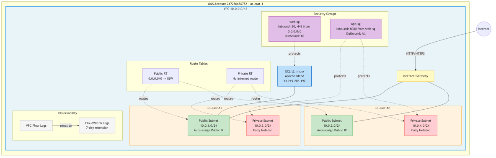

# Episode 1: The VPC

The foundation. Everything else in this series sits on top of this.

I describe the VPC I need to Claude Code, review the Terraform it generates, and deploy it. See [prompt.md](prompt.md) for the exact prompt.

## What gets built

- VPC (10.0.0.0/16)
- 2 public subnets + 2 private subnets across 2 AZs
- Internet Gateway + route tables
- Tiered security groups (web → app)
- VPC Flow Logs to CloudWatch
- No NAT gateway. Cost: ~$0.

## Architecture



## Deploy

```bash
terraform init
terraform apply
```

> If you use named AWS CLI profiles, set `export AWS_PROFILE=<your-profile>` first.

## Destroy

```bash
terraform destroy
```

## Video

Coming soon
